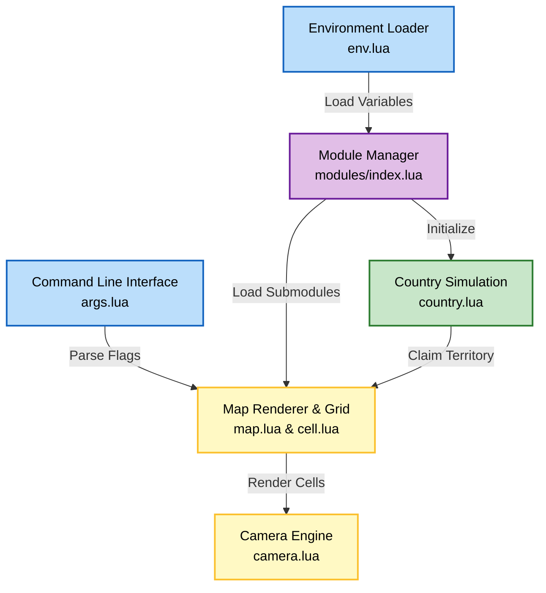
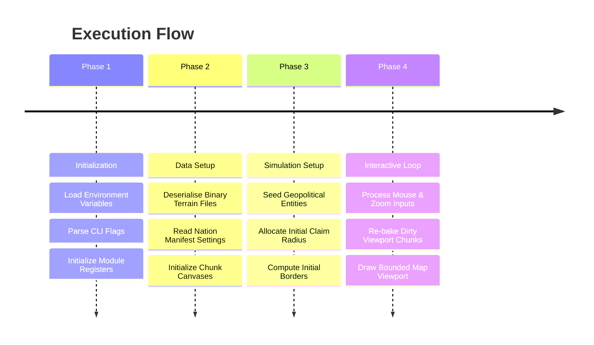

# Athena

Geographical map rendering and geopolitical simulation engine built with Lua and Love2D.

## Authors

- [@0xS4cha](https://github.com/0xS4cha)

## Description

Athena is a lightweight, high-performance simulation and visualization application written in Lua for the Love2D framework. It is designed to deserialize and render large binary heightmaps and simulate territorial control for historical or custom nations.

The engine parses geographic coordinate records from JSON manifests, registers nation structures, assigns random territory colors, and simulates cell-based geopolitical boundaries. Performance is optimized for rendering maps with millions of cells (e.g. 2000x1000 world map grid) by utilizing a viewport-bounded canvas caching (chunking) architecture.



## Setup Instructions

Athena runs on the Love2D framework. Ensure you have Love2D installed on your system.

### Prerequisites

- Love2D (Version 11.0 or higher recommended)
- Git (optional, for cloning)

### Running the Application

1. Clone or download the repository to your local machine.
2. Open a terminal in the project directory.
3. Run the application using the `love` command pointing to the root directory:

```bash
love .
```

Alternatively, if Love2D is not registered to your system path, drag and drop the project root directory onto the Love2D executable.

## Usage

Athena provides a command-line interface to customize loaded maps and visualization behavior.

### Command Line Interface

You can control the map loader using the arguments parsed at startup:

**1. Load a Custom Map**
Athena supports loading various map directories. The default map is the world map. You can specify a different folder from the asset repository using the `--map` flag:
```bash
love . --map assets/maps/europe/
```
```bash
love . --map assets/maps/asia/
```

**2. Enable Heightmap Constraints**
You can launch Athena with the heightmap flag enabled, which restricts zoom controls:
```bash
love . --heightmap
```

### Controls

- **Pan Map**: Click and hold the Right Mouse Button, then drag the mouse to move around the map viewport.
- **Zoom Map**: Scroll up with the Mouse Wheel to zoom in, and scroll down to zoom out (unless disabled by the heightmap flag). The viewport coordinates are automatically updated to scale from the cursor's focus point.
- **Boundaries**: Viewport navigation is constrained so you can never drag or zoom the map out of the screen bounds.

## Project Structure

```
│  conf.lua            # Love2D configuration and window setup
│  main.lua            # Main entry point and game loop lifecycle hooks
│  pyproject.toml      # Dependency configurations (under development)
│  .env.example        # Environment variable template
├─ assets/
│  └─ maps/            # Pre-processed map asset bundles (100+ maps)
│     └─ [map_name]/
│        ├── manifest.json  # Map metadata and starting coordinates for nations
│        ├── map.bin        # Volumetric map data (1x scale binary heightmap)
│        ├── map4x.bin      # Compressed 4x scale binary heightmap
│        ├── map16x.bin     # Compressed 16x scale binary heightmap
│        └── thumbnail.webp # Visual thumbnail of the map
└─ src/
   ├── config/
   │   ├── window.lua  # Global window size and styling properties
   │   └── zone.lua    # Height range configuration for terrain zones
   ├── core/
   │   ├── args.lua    # Command-line argument parser
   │   ├── camera.lua  # Camera zoom, pan, and clamp calculations
   │   ├── class.lua   # Simple prototype class implementation
   │   ├── env.lua     # Config parser loading settings from .env file
   │   ├── json.lua    # JSON encoder and decoder utility
   │   ├── loadFile.lua# File systems read wrapper with memory cache
   │   ├── logger.lua  # ANSI colored logging utility supporting levels
   │   └── uuid.lua    # Unique identification generator (UUID v4)
   └── modules/
       ├── index.lua   # Global module system loader and lifecycle manager
       ├── country/
       │   ├── country.lua  # Object representing nations, colors, and owners
       │   └── index.lua    # Country module registration hooks
       ├── hud/
       │   └── index.lua    # Heads-Up Display registration hooks
       ├── map/
       │   ├── cell.lua     # Single pixel grid cell drawing definitions
       │   ├── index.lua    # Map module registration hooks
       │   └── map.lua      # Map chunk baking system and binary loader
       └── player/
           ├── player.lua   # Player profiles representation
           └── index.lua    # Player module registration hooks
```

## Implementation and Core Algorithms

### 1. Binary Map Serialization

To store and load maps with high resolution efficiently, Athena uses pre-compiled binary heightmap formats (`.bin`).
- Every byte represents a single cell in the grid.
- Using bitwise arithmetic (`bit` library), Athena decodes the 8-bit values into flags and values:
  - **Land Flag (Bit 7)**: Specifies if the cell is land or water.
  - **Shoreline Flag (Bit 6)**: Marks boundary water or sandy cells.
  - **Ocean Flag (Bit 5)**: Represents deep-sea environments.
  - **Magnitude (Bits 0-4)**: Encodes height or depth levels (0 to 31).

### 2. Chunk-Based Canvas Rendering

Rendering individual cell rectangles dynamically is an intensive GPU operation for large maps (e.g. 2,000,000 cells in the world map). Athena implements a spatial caching system:
- The map grid is split into chunks of `100x100` cells.
- Each chunk is rendered onto a persistent `love.graphics.newCanvas` frame container.
- During execution, only the chunks intersecting the camera's viewport are rendered.
- If a cell state changes (e.g., claimed by a country), its respective chunk is marked as dirty (`isDirty = true`) and re-baked.

### 3. Geopolitical Borders and Territory Logic

- Nation seeds are loaded from coordinates declared in each map's `manifest.json`.
- A radial area calculation is applied to register initial cells around coordinates:
  ```
  dx * dx + dy * dy <= offset_radius * offset_radius + 1
  ```
- Cells owned by a nation are shaded with the country's color.
- Outlines (borders) are calculated by inspecting orthogonal neighbors: if a cell has neighbors owned by a different country (or unowned), it is drawn as a border outline. Otherwise, it is drawn as a transparent overlay inside the territory.



## Resources

- [Love2D](https://love2d.org/) - 2D game framework for Lua
- [LuaJIT BitOp](https://luajit.org/ext_bit.html) - Bitwise operations library
- [UUID v4 generator](https://github.com/TobyJennings/uuid.lua) - Toby Jennings UUID module

## Disclaimer

IMPORTANT - Educational use only:
- Use this repository for educational study and simulation reference only.

## Feedback

If you have feedback or feature requests, open an issue or contact the project author.